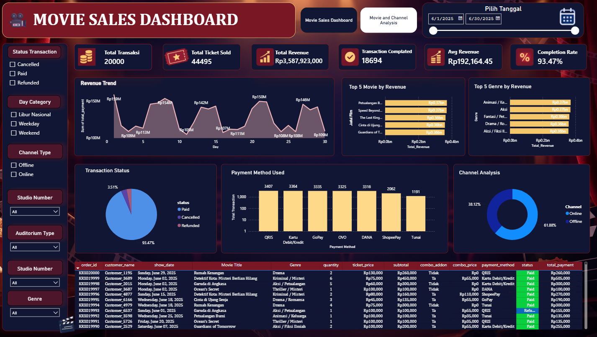
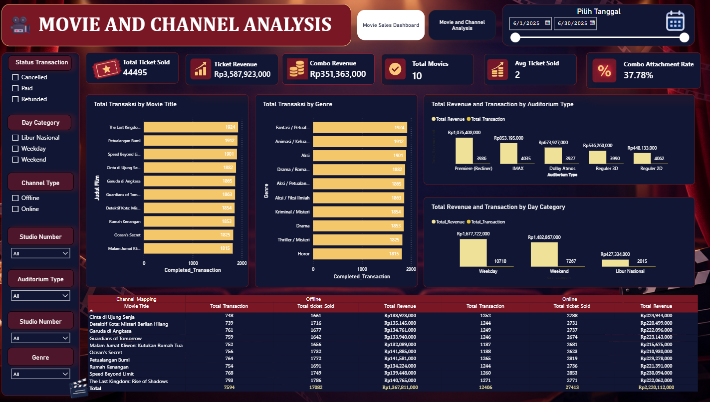

# 🎬 Movie Sales Dashboard – Cinema Sales Analysis

An interactive Power BI dashboard designed to analyze cinema movie sales, transactions, revenue, payment methods, sales channels, movie performance, and transaction status.

This project demonstrates how transactional cinema data can be transformed into an interactive dashboard to monitor sales performance and generate business insights.

---

## 📌 Project Overview

The **Movie Sales Dashboard** is a data analytics project built using **Microsoft Power BI**.

The dashboard analyzes cinema transaction data from different perspectives, including sales performance, movie performance, customer transactions, payment methods, sales channels, studio usage, and transaction status.

The project focuses on transforming raw transaction data into meaningful visual insights that can support business monitoring and decision-making.

### Main questions addressed in this project:

- How are cinema transactions performing over time?
- How much revenue is generated from ticket sales?
- Which movies generate the highest revenue?
- Which genres contribute the most to sales?
- What is the distribution of transaction status?
- Which payment methods are most frequently used?
- Which sales channels generate the most transactions?
- How are transactions distributed across studios?
- How does auditorium type relate to transactions?
- What are the characteristics of individual transactions?

---

## 🎯 Project Objectives

The main objectives of this project are:

1. Monitor overall cinema sales and transaction performance.
2. Analyze revenue and ticket sales trends.
3. Identify movies and genres with strong sales performance.
4. Understand customer transaction behavior.
5. Analyze the usage of payment methods and sales channels.
6. Monitor transaction status and completion rate.
7. Provide an interactive dashboard for business performance monitoring.

---

# 🎬 Cinema Sales Analysis – Dataset

This folder contains the datasets used for the **Movie & Channel Analysis Dashboard**.

The dataset consists of a main cinema transaction dataset and several supporting master/mapping tables used during the data preparation and modeling process.

## 📂 Dataset Structure

| File / Folder | Description |
|---|---|
| [Raw Data Bioskop](./Raw%20Data%20Bioskop/) | Contains the main raw cinema transaction dataset |
| [Channel_Mapping_Cinema.csv](./Channel_Mapping_Cinema.csv) | Mapping table for standardizing cinema transaction channels |
| [Movie Master.xlsx](./Movie%20Master.xlsx) | Master table containing movie information |
| [Payment_Mapping_Cinema.csv](./Payment_Mapping_Cinema.csv) | Mapping table for standardizing payment methods |

## 📊 Dataset Components

### 1. Raw Data Bioskop

The **Raw Data Bioskop** folder contains the main transaction dataset used as the primary source for the analysis.

The dataset contains transaction-level information such as:

- Order ID
- Movie ID
- Movie Title
- Genre
- Rating
- Channel
- Payment Method
- Auditorium Type
- Studio Number
- Show Date & Time
- Seat Number
- Quantity
- Ticket Price
- Combo
- Subtotal
- Total Payment
- Transaction Date
- Transaction Time
- Transaction Status

This dataset serves as the main source for calculating the dashboard's KPIs and performing transaction analysis.

### 2. Movie Master

**Movie Master** is a supporting master table containing additional movie information.

Main columns include:

- Movie ID
- Movie Title
- Genre
- Rating

The table is connected to the transaction data using **Movie ID**.

**Relationship:**

`Movie Master (1) → Raw Transaction Data (*)`

### 3. Channel Mapping

**Channel_Mapping_Cinema.csv** is used to standardize and categorize transaction channels.

Main columns:

- Channel
- Channel Mapping

The table is connected to the transaction data using **Channel**.

**Relationship:**

`Channel Mapping (1) → Raw Transaction Data (*)`

### 4. Payment Mapping

**Payment_Mapping_Cinema.csv** is used to standardize and categorize payment methods.

Main columns:

- Payment Method
- Payment Mapping

The table is connected to the transaction data using **Payment Method**.

**Relationship:**

`Payment Mapping (1) → Raw Transaction Data (*)`

## 🧹 Data Preparation

The data was prepared in Power BI before being used for dashboard development.

The preparation process includes:

1. Reviewing the available fields and data structure.
2. Organizing transaction and reference data.
3. Connecting the transaction table with movie, channel, and payment mapping tables.
4. Establishing relationships between the tables.
5. Preparing numerical fields for aggregation.
6. Creating the necessary calculations and measures for dashboard KPIs.
7. Designing interactive visualizations based on the business questions.

---
## 📊 Dashboard

The dashboard provides an interactive overview of movie sales performance.

### Dashboard Preview

## 💡 Business Insights

- Total revenue mencapai **Rp3,59 Miliar** dari **20.000 transaksi** dan **44.495 tiket terjual**, dengan rata-rata **2 tiket per transaksi**.
- **Online** menjadi channel utama dengan kontribusi **61,88% transaksi** dan revenue sekitar **Rp2,22 Miliar**, lebih tinggi dibandingkan Offline sebesar Rp1,37 Miliar.
- **Petualangan Bumi** dan **Speed Beyond...** menjadi movie dengan revenue tertinggi, masing-masing sekitar **Rp370 Juta**.
- Genre **Animasi/Keluarga** dan **Aksi** menunjukkan kontribusi revenue tertinggi, masing-masing sekitar **Rp370 Juta**.
- **QRIS** menjadi metode pembayaran paling sering digunakan dengan **3.407 transaksi**, diikuti Kartu Debit/Kredit sebanyak 3.364 transaksi dan GoPay sebanyak 3.335 transaksi.
- **93,47% transaksi berhasil diselesaikan**, sementara 3,51% cancelled dan 3,02% refunded, sehingga terdapat **6,53% transaksi yang berpotensi menyebabkan kehilangan revenue**.
- Revenue mengalami fluktuasi sepanjang **Juni 2025**, dengan revenue harian berada pada kisaran **Rp103–159 Juta**.
- **Weekday** menjadi kontributor revenue terbesar dengan sekitar **Rp1,68 Miliar**, diikuti Weekend Rp1,48 Miliar dan Libur Nasional Rp427 Juta.
- **Auditorium Premiere** menghasilkan revenue tertinggi sekitar **Rp1,08 Miliar**, diikuti IMAX sekitar Rp853 Juta.
- **Combo Attachment Rate sebesar 37,78%** menunjukkan adanya peluang untuk meningkatkan revenue melalui strategi bundling tiket dan combo.
